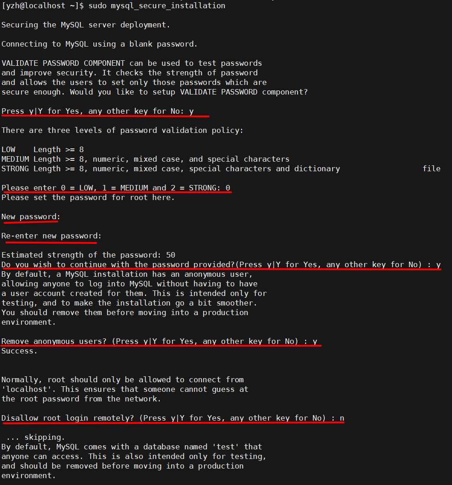
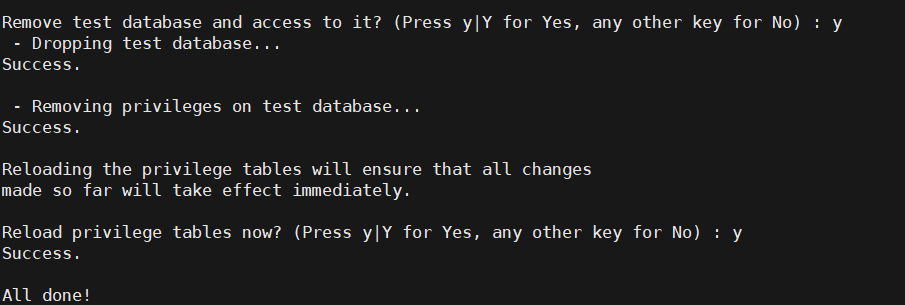

# 安装

`dnf install @mysql`

# 配置

## 配置开机启动

`systemctl enable --now mysqld`

## 检查mysql是否正在进行

`systemctl status mysqld`

## 初始化设置

`mysql_secure_installation`

要求你配置VALIDATE PASSWORD component（验证密码组件）： 输入y ，回车进入该配置

- 选择密码验证策略等级， 我这里选择0 （low），回车
- 输入新密码两次
- 确认是否继续使用提供的密码？输入y ，回车
- 移除匿名用户？ 输入y ，回车
- 不允许root远程登陆？ 我这里需要远程登陆，所以输入n ，回车
- 移除test数据库？ 输入y ，回车
- 重新载入权限表？ 输入y ，回车





## 配置远程登录

```shell
$ mysql -uroot -p
mysql > use mysql;
mysql > update user set host='%' where user='root';
mysql > flush privileges;
```

## 配置防火墙（可能需要）

```shell
$ firewall-cmd --add-port=3306/tcp --permanent
$ firewall-cmd --reload
```

## 关闭mysql主机查询dns

```shell
$ vim /etc/my.cnf
# 添加
[mysqld]
skip-name-resolve
# 重启服务
systemctl restart mysqld
```

